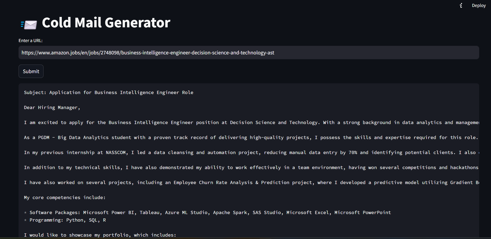
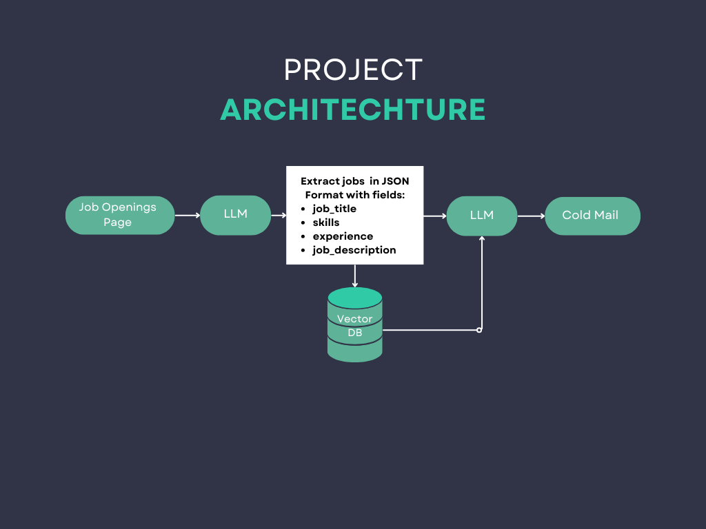

# 📧 Cold Email Generator for Service Companies

A Cold Email Generator designed for service companies and job seekers using **GROQ**, **LangChain**, and **Streamlit**. The tool allows users to input the URL of a company’s careers page to extract job listings and generate personalized cold emails. Each email includes portfolio links sourced from a vector database, matched specifically to the job descriptions.

**Imagine a scenario:**

- If Amazon has an opening for a **Business Intelligence Engineer** in the **Decision Science and Technology** (AST) team, a PGDM - Big Data Analytics student can use this tool to reach out to Amazon with a customized cold email, complete with links to their portfolio.



## Architecture Diagram



## Features

- **Job Listing Extraction**: Extracts job postings directly from a company's careers page.
- **Personalized Cold Emails**: Auto-generates email content based on job descriptions and user details.
- **Portfolio Integration**: Embeds relevant portfolio links, sourced from a vector database, into the email for enhanced personalization.
- **User-Friendly Interface**: A simple and interactive experience powered by Streamlit.

## Set-up

### Prerequisites

- Python 3.7+
- GROQ API Key, obtainable from [GROQ Console](https://console.groq.com/keys)

### Installation

1. **Get the API Key**: Obtain your API key from [GROQ Console](https://console.groq.com/keys) and add it to the `.env` file.
   - Inside `app/.env`, update the `GROQ_API_KEY` value:
     ```dotenv
     GROQ_API_KEY=your_api_key_here
     ```

2. **Install Dependencies**:
   ```bash
   pip install -r requirements.txt
